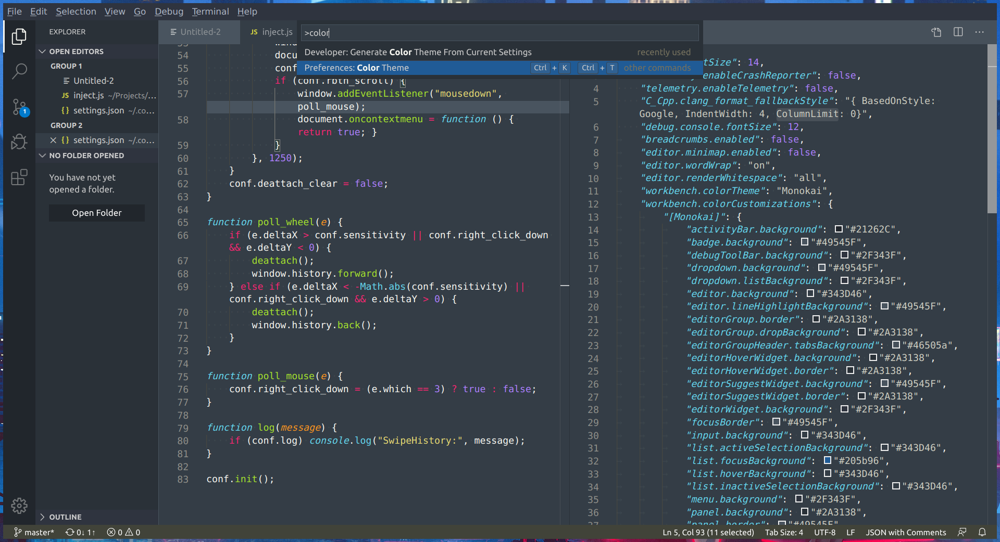

## Arc Dark inspired theme for Visual Studio Code

Just paste the contents of [vscode-arc-dark.txt](https://github.com/johanson/vscode-arc-dark/blob/master/vscode-arc-dark.txt) to your settings or workbench file.

Switch to Monokai since it's used as a base theme.

